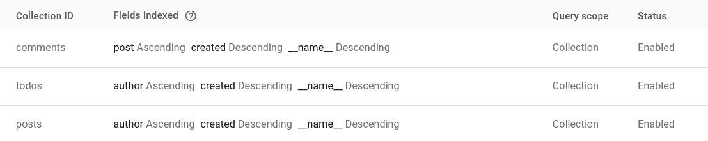
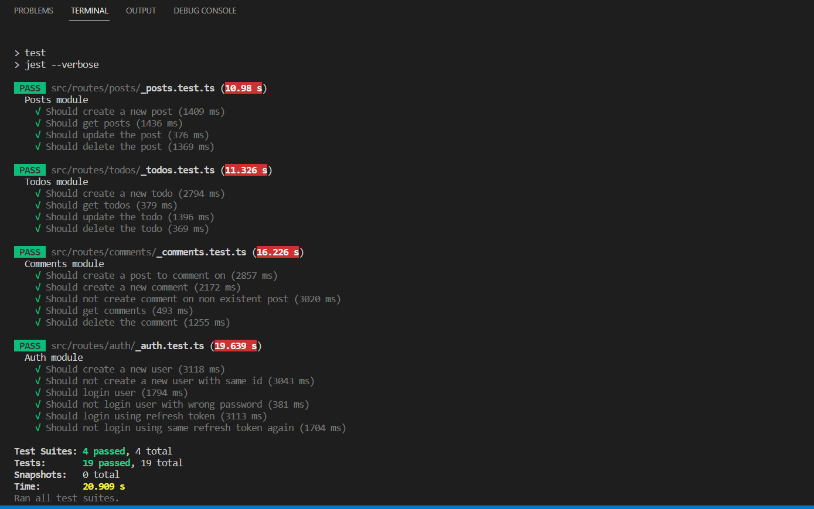

# API endpoints

API base URL: https://api-riuwhqsd3q-uc.a.run.app

Sample web app: https://social-to-do.web.app

You can create a new account or use (Amandeep,abc) as credentials

## Authentication
### POST /auth/signup
Request body
```json
{
    "id": "new_test_id",
    "password": "password"
}
```
Response
```json
"New user created"
```

### POST /auth/signin
Request body
```json
{
    "id": "new_test_id",
    "password": "password"
}
```
Response
```json
{
    "token": "<GENERATED TOKEN>",
    "refresh": "<GENERATED REFRESH TOKEN>",
    "message": "Login successful"
}
```

### POST /auth/token
Request body
```json
{
    "id": "new_test_id",
    "refresh": "<GENERATED REFRESH TOKEN>"
}
```
Response
```json
{
    "token": "<NEW GENERATED TOKEN>",
    "refresh": "<NEW GENERATED REFRESH TOKEN>",
    "message": "Login successful"
}
```

## ⚠ For all further requests, include "Bearer \<token>" in Authorization header 

## Todos

### POST /todos
Request body
```json
{
   "content": "To do item",
   "status": "pending"
}
```
Response
```json
{
    "id": "OqbEMNChr8i3IKZbep2Z"
}
```

### GET /todos
Query parameters (optional): author, after, limit \
Response
```json
[
    {
        "author": "new_test_id",
        "created": 1680426644749,
        "id": "OqbEMNChr8i3IKZbep2Z",
        "content": "To do item",
        "status": "pending"
    }
]
```

### PUT /todos/:id
Request body
```json
{
   "content": "To do item updated",
   "status": "pending"
}
```
Response
```json
true
```

### DELETE /todos/:id
Response
```json
true
```

## Posts

### POST /posts
Request body
```json
{
   "content": "New post"
}
```
Response
```json
{
    "id": "xPKd81MWx9FJsPbQOHF5"
}
```

### GET /posts
Query parameters (optional): author, after, limit \
Response
```json
[
    {
        "author": "new_test_id",
        "created": 1680427367026,
        "id": "xPKd81MWx9FJsPbQOHF5",
        "content": "New post"
    }
]
```

### PUT /posts/:id
Request body
```json
{
   "content": "Post updated",
   "status": "pending"
}
```
Response
```json
true
```

### DELETE /posts/:id
Response
```json
true
```

## Comments

### POST /comments
Request body
```json
{
   "content": "Comment on a post",
   "post": "2iWwmKUwlN87EOHP5QIe"
}
```
Response
```json
{
    "id": "QXMSs3ZBf2CxlkKJHeMo"
}
```

### GET /comments
Query parameters (optional): post, after, limit \
Response
```json
[
    {
        "post": "2iWwmKUwlN87EOHP5QIe",
        "author": "new_test_id",
        "created": 1680427752284,
        "id": "QXMSs3ZBf2CxlkKJHeMo",
        "content": "Comment on a post"
    }
]
```

### DELETE /comments/:id
Response
```json
true
```

## List of compound indexes


## Unit tests


## Web app (VueJS)


# Personal logs during development

## Why separate folder for each route, instead of separate file for each route
You can and should contain request types within the same file as the request itself and just keep other types separate.\
Its very tempting to abstract something that we see as repeating, but its important to keep in mind that being reusable should not be the only criteria for abstraction.

For example, if down the road, we want to make a small change to procedures in one route, but that procedure is also being used by other routes, it quickly goes from "code looks cleaner this way" to "just sacrificed 2 days of costly development time for something that could have been done within 10 minutes"

## Why one directional relationship from comments to posts, not other way around or something else?

Document size limit in databases like firestore and mongodb will otherwise limit how much comments you can accomodate in a post.

Firestore however provides a subcollection feature, but general pattern while working with NoSQL databses should be that if we're not able to migrate our architecture from one database to other similar database (For ex. Firestore -> MongoDB), then we need to reconsider that architecture.\
This assumption makes the overall architecture clean, safe and scalable.

In most usecases, comments should only be visible when user clicks on show comments as it reduces loading overhead and makes the overall app faster. In firestore, fetching a document means that you'll get and be charged for the whole document.

Also, keeping this relationship will help us implement other features in future like replies on comments (Where a reply is just a comment on previous comment).

Implementing security becomes easier, as users who are not the authors of that post will not need to be granted access to the document of a post they are commenting on.

delete all comments feature for user (lets say the user wants that before he deletes the account)

Performing analytics and complex queries becomes harder and harder the more nested any data is.


## Decision faced: To put make getComments controller part of comments router, or part of posts controller.

In the end, it will be a business decision. I chose to put all the read and write operations in comments module itself purely because it makes it very easy to do the unit testing, but there are plenty of reasons not to put it within comment module itself:

There can be multiple ways to access the comments that might be needed: by post, by author, by comment id itself and so on, so its more logical to separate the "read" concerns. This will also result in a more sensible URL structure. For ex. "/posts/123/comments" looks like it will return comments for the post "123", and so it will. (right now it looks like "/comments?post=")


## Refresh tokens

Refresh tokens implemented simply are a security risk. So we are going to rotate them, (Invalidate previous refresh token when generating a new access token).


## Caveats for this app (as of now):
There is no refined exeptional handeling, just where it is absolutely needed. I usually like to spend more time designing exception handling than currently on our hands.\
No separate integration testing, just unit testing. Hence, middlewares including role based access control are left out of tests.
