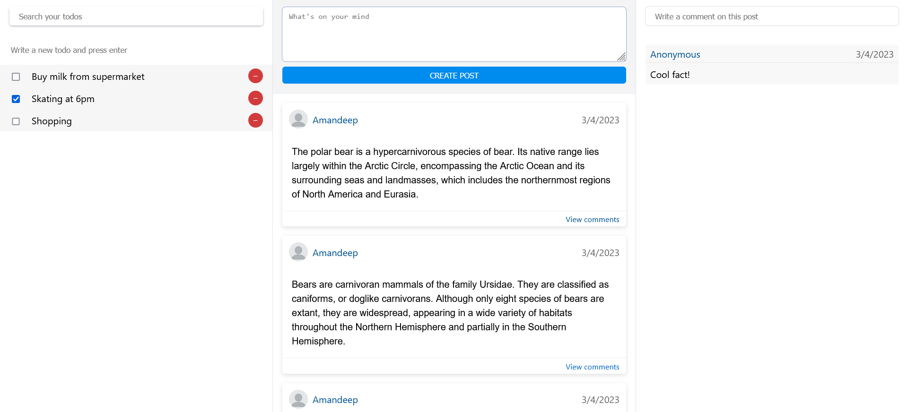

# API endpoints

This is an experimental NodeJS project.

API base URL: https://api-riuwhqsd3q-uc.a.run.app

Sample web app: https://social-to-do.web.app (for the web you can create a new account or use (Amandeep,abc) as credentials)

## Authentication
### POST /auth/signup
Request body
```json
{
    "id": "new_test_id",
    "password": "password"
}
```
Response
```json
"New user created"
```

### POST /auth/signin
Request body
```json
{
    "id": "new_test_id",
    "password": "password"
}
```
Response
```json
{
    "token": "<GENERATED TOKEN>",
    "refresh": "<GENERATED REFRESH TOKEN>",
    "message": "Login successful"
}
```

### POST /auth/token
Request body
```json
{
    "id": "new_test_id",
    "refresh": "<GENERATED REFRESH TOKEN>"
}
```
Response
```json
{
    "token": "<NEW GENERATED TOKEN>",
    "refresh": "<NEW GENERATED REFRESH TOKEN>",
    "message": "Login successful"
}
```

## ⚠ For all further requests, include "Bearer \<token>" in Authorization header 

## Todos

### POST /todos
Request body
```json
{
   "content": "To do item",
   "status": "pending"
}
```
Response
```json
{
    "id": "OqbEMNChr8i3IKZbep2Z"
}
```

### GET /todos
Query parameters (optional): author, after, limit \
Response
```json
[
    {
        "author": "new_test_id",
        "created": 1680426644749,
        "id": "OqbEMNChr8i3IKZbep2Z",
        "content": "To do item",
        "status": "pending"
    }
]
```

### PUT /todos/:id
Request body
```json
{
   "content": "To do item updated",
   "status": "pending"
}
```
Response
```json
true
```

### DELETE /todos/:id
Response
```json
true
```

## Posts

### POST /posts
Request body
```json
{
   "content": "New post"
}
```
Response
```json
{
    "id": "xPKd81MWx9FJsPbQOHF5"
}
```

### GET /posts
Query parameters (optional): author, after, limit \
Response
```json
[
    {
        "author": "new_test_id",
        "created": 1680427367026,
        "id": "xPKd81MWx9FJsPbQOHF5",
        "content": "New post"
    }
]
```

### PUT /posts/:id
Request body
```json
{
   "content": "Post updated",
   "status": "pending"
}
```
Response
```json
true
```

### DELETE /posts/:id
Response
```json
true
```

## Comments

### POST /comments
Request body
```json
{
   "content": "Comment on a post",
   "post": "2iWwmKUwlN87EOHP5QIe"
}
```
Response
```json
{
    "id": "QXMSs3ZBf2CxlkKJHeMo"
}
```

### GET /comments
Query parameters (optional): post, after, limit \
Response
```json
[
    {
        "post": "2iWwmKUwlN87EOHP5QIe",
        "author": "new_test_id",
        "created": 1680427752284,
        "id": "QXMSs3ZBf2CxlkKJHeMo",
        "content": "Comment on a post"
    }
]
```

### DELETE /comments/:id
Response
```json
true
```

## List of compound indexes


## Unit tests


## Web app (VueJS)

